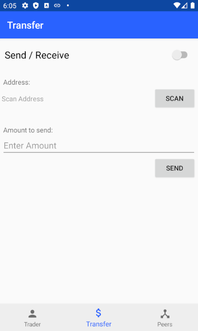
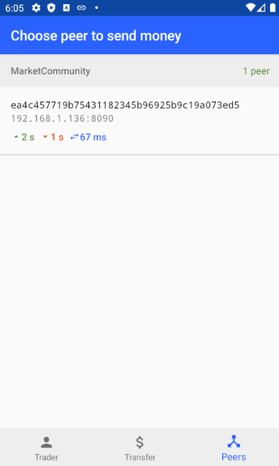
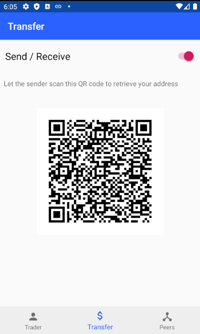

# AI trading bot

The AI trading bot app consist of two parts.
1. An AI trading bot using a Naive Bayes Classifier which buys or sells Bitcoins using a decentralized market.
2. Sending and receiving money functionality to other peers.

## AI trading bot

The AI trading but is shown upon opening the app. It receives bids and asks from other peers which want to buy or sell Bitcoins for Dymbe Dollars.
Upon receiving a bid or ask, it decides to either execute the offer or not.
The bot can be toggled on and off using the toggle on the home screen.

### Bids/Asks
The bids and asks are received messages from other peers. For example generated by the Trustchain Bid-ask generator app.
The app listens to one certain payload, but more types of payloads could be trade with several currencies or other types of trading.
Upon receiving a bid or ask, the AI can send a proposal block to the sender of the message to make the trade. After the receiver sings this block, the transaction is valid.

### Naive Bayes Classifier
This naive implementation of a bayesian classifier is able to determine the mean and standard deviation of recent trades, and determines whether or not to fill a bid/ask order depending on how far away from the mean price the limit order is.

v0.1 implements a trained bot for the DD_BTC pairing, assuming a mean of 100DD per 1BTC. Features are described below.

#### Features

1. Columns:
    1. Price (DD_BTC pairing, integer values only)
    1. Buy/Sell (Binary, 0 for buy, 1 for sell)

1. Training data: 100,000 data points with 2 target labels
    * 0: Below mean
    * 1: Above mean

#### Training the model
Training data is in .csv format. Import the training data by creating a `NaiveBayes` object with the training data as argument. After instantiating an instance of the model, it is automatically trained for prediction.

#### Obtaining Predictions
Use `predict` in NaiveBayesClassifier to obtain a target label prediction. `predict` will choose the label with the highest probability.
Use `predictWithProbability` in NaiveBayesClassifier to obtain a target label prediction and its associated probability.

### Wallet
After the AI algorithm has decided to either buy or sell, it virtually trades the coins and updates its wallet.
By default, it does try to make the transaction, since it does not send a proposal block upon accepting an offer
In order to switch this on, look at the comments in TraderFragment.accept().

## Sending and receiving money to other peers.
In the sending/receiving money fragment one can send money to a different peer, or receive money from a different peer.
There are two ways to find a public key:
1. The other peer presses the send/receive toggle. His public key will be shown in a QR-code. Now upon pressing the "scan" button on your device, you can scan the QR code.
1. Go to the "Peers" fragment in the app, and press a public key.

The public key is now filled in the Transfer fragment. Now you can enter an amount and send the money.
The receiving peer will receive a proposal block in its chain.

